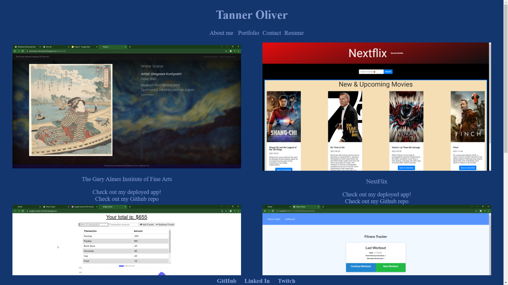

# React Portfolio

## Description

In this assignment we were told to build a portfolio on a single page with react.

## Table of Contents

- [Screen Shot](#ScreenShot)
- [License](#license)
- [Questions](#questions)

## ScreenShot

## License

This project is under the MIT license.

## Questions

My GitHub is: [TannerOliver](https://github.com/TannerOliver)
You can reach me at Email: 435.tanner@gmail.com
